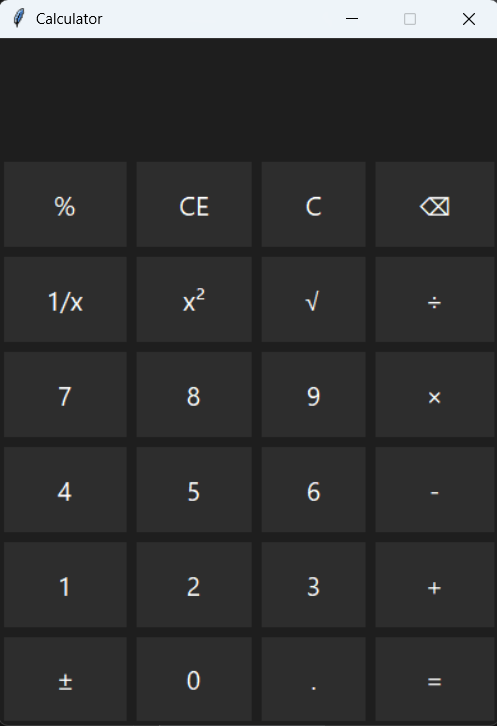

# Simple Calculator

A basic calculator application built using Python and Tkinter.

## Features

- Standard arithmetic operations: addition (+), subtraction (-), multiplication (×), division (÷)
- Advanced functions:
  - Square root (√)
  - Square (x²)
  - Reciprocal (1/x)
  - Percentage (%)
  - Negation (±)
  - Clear Entry (CE), Clear (C), and Backspace (⌫)
- Clean dark-themed user interface
- Responsive button grid layout
- Error handling for invalid inputs

## Screenshots

  

## Usage

1. Make sure you have Python installed (version 3.x recommended).  
2. Run the `calculator.py` script:

```bash
python calculator.py
